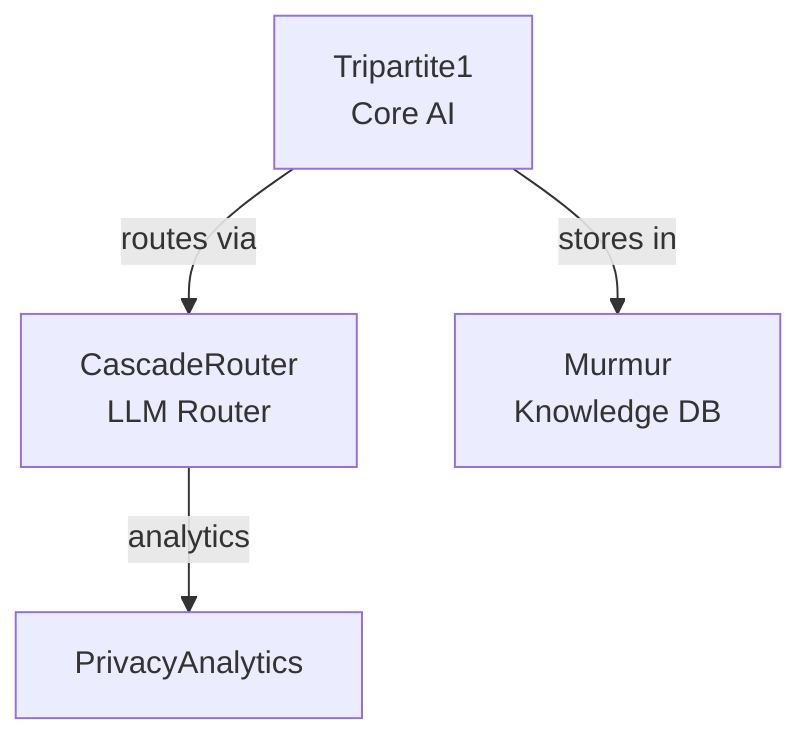

# SuperInstance Ecosystem Analysis

> **Analysis Date**: 2026-01-08
> **Total Repositories**: 31
> **Primary Languages**: Rust, TypeScript
> **Organization**: https://github.com/SuperInstance

---

## Executive Summary

The SuperInstance GitHub ecosystem represents a comprehensive **privacy-first, local-first AI infrastructure** built around a core tripartite consensus system. The ecosystem is organized into 5 tiers, from core infrastructure to end-user applications, with strong emphasis on:

- **Privacy-first architecture** - Data stays local
- **Hardware awareness** - Optimize for available resources
- **Multi-agent orchestration** - Coordinate AI swarms
- **Developer tools** - Build on the platform
- **Type safety** - Rust and TypeScript throughout

---

## Repository Inventory

### Core AI/LLM (5 repositories)

| Repository | Language | Purpose | Status |
|------------|----------|---------|--------|
| **Tripartite1** | Rust | Privacy-first, local-first AI with tripartite consensus (Pathos, Logos, Ethos agents) | ✅ Active (Phase 2) |
| **equilibrium-tokens** | Rust | Constraint grammar for human-machine conversation navigation | ✅ Active |
| **Murmur** | TypeScript | Self-populating TensorDB wiki and knowledge graph | ✅ Active |
| **SwarmOrchestration** | TypeScript | Multi-agent orchestration for distributed AI systems | ✅ Active |
| **CascadeRouter** | TypeScript | Intelligent LLM routing with cost optimization | ✅ Active |

### Privacy & Security (3 repositories)

| Repository | Language | Purpose | Status |
|------------|----------|---------|--------|
| **Privacy-First-Analytics** | TypeScript | Local-only analytics, no data leaves device | ✅ Active |
| **Auto-Backup-Compression-Encryption** | - | Automated secure backups | 🔄 Framework |
| **Sandbox-Lifecycle-Manager** | TypeScript | Manage sandboxed code execution | 🔄 Framework |

### Agent Management (3 repositories)

| Repository | Language | Purpose | Status |
|------------|----------|---------|--------|
| **Agent-Lifecycle-Registry** | - | Track and manage agent instances | 🔄 Framework |
| **Proactive-Planning-AI-Hub** | - | AI-powered planning and task coordination | 🔄 Framework |
| **Vibe-Code-Agent-Gen** | - | Generate code agents | 🔄 Framework |

### Developer Tools (3 repositories)

| Repository | Language | Purpose | Status |
|------------|----------|---------|--------|
| **In-Browser-Dev-Tools** | - | Browser-based development environment | 🔄 Framework |
| **Automatic-Type-Safe-IndexedDB** | TypeScript | Type-safe IndexedDB wrapper | 🔄 Framework |
| **Spreader-tool** | TypeScript | Deployment and spreading tool | ✅ Active |

### Hardware & Performance (4 repositories)

| Repository | Language | Purpose | Status |
|------------|----------|---------|--------|
| **Hardware-Aware-Flagging** | TypeScript | Device capability detection and feature flags | 🔄 Framework |
| **hardware-capability-profiler** | TypeScript | Profile hardware capabilities | 🔄 Framework |
| **Auto-Tuning-Engine** | - | Automatic performance optimization | 🔄 Framework |
| **optimized-system-monitor** | - | Efficient system monitoring | 🔄 Framework |

### Data & Analytics (3 repositories)

| Repository | Language | Purpose | Status |
|------------|----------|---------|--------|
| **In-Browser-Vector-Search** | - | Client-side vector similarity search | 🔄 Framework |
| **Bayesian-Multi-Armed-Bandits** | TypeScript | Probabilistic decision optimization | 🔄 Framework |

### Communication & Sync (3 repositories)

| Repository | Language | Purpose | Status |
|------------|----------|---------|--------|
| **Real-Time-Collaboration** | - | Multi-user real-time editing | 🔄 Framework |
| **multi-device-sync** | - | Cross-device synchronization | 🔄 Framework |
| **AI-Smart-Notifications** | - | Intelligent notification management | 🔄 Framework |

### ML/AI Components (3 repositories)

| Repository | Language | Purpose | Status |
|------------|----------|---------|--------|
| **JEPA-Real-Time-Sentiment-Analysis** | - | Real-time sentiment with JEPA architecture | 🔄 Framework |
| **Private-ML-Personalization** | - | On-device ML personalization | 🔄 Framework |
| **MPC-Orchestration-Optimization** | - | Multi-party computation optimization | 🔄 Framework |

### UI & UX (2 repositories)

| Repository | Language | Purpose | Status |
|------------|----------|---------|--------|
| **Dynamic-Theming** | - | Adaptive theme system | 🔄 Framework |
| **PersonalLog** | TypeScript | Personal logging and journaling | ✅ Active |

### Utilities (2 repositories)

| Repository | Language | Purpose | Status |
|------------|----------|---------|--------|
| **Central-Error-Manager** | - | Unified error handling | 🔄 Framework |
| **universal-import-export** | - | Data migration tools | 🔄 Framework |

### Applications (1 repository)

| Repository | Language | Purpose | Status |
|------------|----------|---------|--------|
| **fishermanscopilot** | - | AI assistant for fishermen and boaters | ✅ Active |

**Legend**:
- ✅ Active = Has README and clear purpose
- 🔄 Framework = Repository exists but needs documentation/implementation

---

## Ecosystem Tiers

```
┌─────────────────────────────────────────────────────────────┐
│                    TIER 1: CORE INFRASTRUCTURE              │
│  (Foundational systems that power everything else)          │
│                                                               │
│  • Tripartite1 - Tripartite consensus AI system             │
│  • equilibrium-tokens - Conversation navigation              │
│  • CascadeRouter - Intelligent LLM routing                   │
└────────────────────────┬────────────────────────────────────┘
                         │
┌────────────────────────▼────────────────────────────────────┐
│                   TIER 2: SERVICES & MIDDLEWARE             │
│  (Shared services used by multiple applications)            │
│                                                               │
│  Knowledge & Coordination:                                   │
│  • Murmur - Knowledge tensor database                        │
│  • SwarmOrchestration - Multi-agent coordination             │
│  • In-Browser-Vector-Search - Semantic search               │
│  • Real-Time-Collaboration - Multi-user sync                │
│                                                               │
│  Infrastructure Services:                                    │
│  • Privacy-First-Analytics - Local metrics                  │
│  • Hardware-Aware-Flagging - Device detection               │
│  • hardware-capability-profiler - Capability profiling      │
│  • Agent-Lifecycle-Registry - Agent management              │
└────────────────────────┬────────────────────────────────────┘
                         │
┌────────────────────────▼────────────────────────────────────┐
│                      TIER 3: DEVELOPER TOOLS                │
│  (Tools for building on SuperInstance)                      │
│                                                               │
│  • In-Browser-Dev-Tools - Browser development               │
│  • Automatic-Type-Safe-IndexedDB - Type-safe storage        │
│  • Spreader-tool - Deployment automation                    │
│  • Central-Error-Manager - Unified error handling           │
│  • universal-import-export - Data migration                 │
└────────────────────────┬────────────────────────────────────┘
                         │
┌────────────────────────▼────────────────────────────────────┐
│                   TIER 4: SUPPORTING LIBRARIES              │
│  (Specialized components for specific features)             │
│                                                               │
│  ML/AI: Bayesian-Multi-Armed-Bandits, JEPA, Private-ML      │
│  Performance: Auto-Tuning-Engine, optimized-system-monitor   │
│  Security: Sandbox-Lifecycle-Manager, Backup encryption     │
│  UX: Dynamic-Theming, AI-Smart-Notifications, sync          │
└────────────────────────┬────────────────────────────────────┘
                         │
┌────────────────────────▼────────────────────────────────────┐
│                     TIER 5: APPLICATIONS                    │
│  (End-user products built on SuperInstance)                 │
│                                                               │
│  • fishermanscopilot - AI for fishing/boating               │
│  • PersonalLog - Personal journaling with wiki              │
│  • Vibe-Code-Agent-Gen - Code agent generator               │
│  • Proactive-Planning-AI-Hub - AI planning assistant        │
└─────────────────────────────────────────────────────────────┘
```

---

## Integration Opportunities

### High-Impact Integrations (Priority 1)

These integrations would create significant value by connecting core systems:

#### 1. Tripartite1 + Murmur = Persistent Agent Memory
**Value**: Tripartite agents gain long-term memory
**Implementation**:
```rust
// In Tripartite1
use murmur_client::MurmurClient;

impl Agent {
    async fn recall(&self, query: &str) -> Vec<Memory> {
        murmur.search(query).await
    }

    async fn remember(&self, memory: Memory) {
        murmur.store(memory).await
    }
}
```
**Benefits**:
- Agents learn from past conversations
- Shared knowledge across all agents
- Persistent user preferences

#### 2. Tripartite1 + CascadeRouter = Smart Cloud Escalation
**Value**: Optimize when to use local vs cloud LLMs
**Implementation**:
```rust
// In Tripartite1 CLI layer
let router = CascadeRouter::new()
    .with_strategy(RoutingStrategy::Cost)
    .with_budget(max_cost);

let decision = router.route(&agent_request);
match decision.provider {
    Provider::Local => run_local_agent(),
    Provider::Cloud => escalate_to_cloud(),
}
```
**Benefits**:
- Automatic cost optimization
- Fallback when hardware insufficient
- Quality-aware routing

#### 3. Tripartite1 + Privacy-First-Analytics = Usage Metrics
**Value**: Understand how agents are used without compromising privacy
**Implementation**:
```rust
// In Tripartite1
use privacy_analytics::Tracker;

let tracker = Tracker::local_only();
tracker.track("agent_consensus_rounds", consensus_rounds);
tracker.track("escalation_rate", escalations / total_queries);
// All data stays local
```
**Benefits**:
- Product insights without privacy concerns
- Performance monitoring
- User behavior patterns

#### 4. SwarmOrchestration + Tripartite1 = Horizontal Scaling
**Value**: Scale tripartite consensus across multiple machines
**Implementation**:
```typescript
// SwarmOrchestration coordinates multiple Tripartite instances
const swarm = new SwarmOrchestration();

await swarm.registerAgent({
    type: 'tripartite',
    id: 'instance-1',
    capabilities: ['pathos', 'logos', 'ethos'],
    endpoint: 'ws://instance-1.internal'
});

// Distribute consensus across instances
const result = await swarm.distributeTask(agentRequest);
```
**Benefits**:
- Parallel consensus computation
- Fault tolerance
- Geographic distribution

### Medium-Impact Integrations (Priority 2)

#### 5. Murmur + In-Browser-Vector-Search = Semantic Wiki
**Value**: Fast semantic search in knowledge base
**Benefits**:
- Instant related content discovery
- Better knowledge organization
- Improved agent recall

#### 6. CascadeRouter + Hardware-Aware-Flagging = Device-Optimized Routing
**Value**: Route requests based on device capabilities
**Benefits**:
- Mobile devices use cheaper models
- Desktops use higher-quality models
- Automatic capability detection

#### 7. equilibrium-tokens + Tripartite1 = Structured Conversations
**Value**: Apply conversation constraints to agent interactions
**Benefits**:
- Prevent prompt injection
- Enforce conversation boundaries
- Safer agent interactions

#### 8. All Repos + Central-Error-Manager = Unified Error Handling
**Value**: Consistent error reporting across ecosystem
**Benefits**:
- Better debugging
- Aggregated error analytics
- Improved user experience

### Low-Impact Integrations (Priority 3)

#### 9. Privacy-First-Analytics + Automatic-Type-Safe-IndexedDB
**Value**: Type-safe local analytics storage

#### 10. Real-Time-Collaboration + Murmur
**Value**: Multi-user wiki editing

#### 11. SwarmOrchestration + Agent-Lifecycle-Registry
**Value**: Better agent management in swarms

---

## Dependency Graph

```
                    ┌─────────────────┐
                    │  Applications   │
                    │  (Tier 5)       │
                    └────────┬────────┘
                             │
                    ┌────────▼────────┐
                    │   Libraries     │
                    │  (Tier 4)       │
                    └────────┬────────┘
                             │
        ┌────────────────────┼────────────────────┐
        │                    │                    │
┌───────▼────────┐  ┌────────▼────────┐  ┌──────▼───────┐
│ Developer Tools│  │   Services      │  │    Core      │
│   (Tier 3)     │  │   (Tier 2)      │  │  (Tier 1)    │
└────────────────┘  └─────────────────┘  └──────────────┘

Key Dependencies:

Tripartite1 (Core)
  ├─→ CascadeRouter (LLM routing)
  ├─→ Murmur (memory storage)
  ├─→ Privacy-First-Analytics (metrics)
  └─→ equilibrium-tokens (conversation constraints)

Murmur (Service)
  ├─→ In-Browser-Vector-Search (semantic search)
  ├─→ Real-Time-Collaboration (multi-user)
  └─→ Privacy-First-Analytics (usage tracking)

CascadeRouter (Core)
  ├─→ Hardware-Aware-Flagging (device detection)
  ├─→ Bayesian-Multi-Armed-Bandits (route optimization)
  └─→ Privacy-First-Analytics (routing analytics)

SwarmOrchestration (Service)
  ├─→ Tripartite1 (agent implementation)
  ├─→ CascadeRouter (LLM routing)
  ├─→ Murmur (shared knowledge)
  ├─→ Real-Time-Collaboration (agent comms)
  └─→ Agent-Lifecycle-Registry (agent management)

All Repos → Central-Error-Manager (unified errors)
```

---

## Tool Gaps Analysis

### Missing Tools (Build Recommendations)

Based on the ecosystem analysis, these tools would fill important gaps:

#### 1. ** unified-logging** (Priority: HIGH)
**Purpose**: Structured logging across all SuperInstance projects
**Why Needed**:
- Debugging distributed systems (SwarmOrchestration)
- Tracking consensus rounds (Tripartite1)
- Performance monitoring
**Features**:
- Structured JSON logging
- Log levels (ERROR, WARN, INFO, DEBUG, TRACE)
- Integration with Privacy-First-Analytics
- Local log rotation

#### 2. ** configuration-manager** (Priority: HIGH)
**Purpose**: Unified configuration management
**Why Needed**:
- Multiple repos need consistent config handling
- Hardware-aware settings
- User preferences across apps
**Features**:
- Type-safe config loading
- Environment variable support
- Hardware capability detection integration
- Hot-reload for development

#### 3. ** testing-framework** (Priority: MEDIUM)
**Purpose**: Testing utilities for SuperInstance ecosystem
**Why Needed**:
- Agent system testing
- Consensus simulation
- Privacy assertion testing
**Features**:
- Mock agent implementations
- Consensus testing harness
- Privacy leak detection
- Property-based testing

#### 4. ** cli-toolkit** (Priority: MEDIUM)
**Purpose**: Shared CLI utilities for Rust projects
**Why Needed**:
- Tripartite1 CLI can be reused
- Consistent UX across tools
**Features**:
- Common command patterns
- Progress bars
- Interactive prompts
- Color output

#### 5. ** documentation-generator** (Priority: LOW)
**Purpose**: Auto-generate docs from code + READMEs
**Why Needed**:
- Keep ecosystem docs in sync
- Unified documentation style
**Features**:
- Extract from README + code comments
- Generate markdown documentation
- Ecosystem-wide doc search

### Existing Tools That Need Enhancement

1. **equilibrium-tokens**: Needs integration guide with Tripartite1
2. **Murmur**: Needs TypeScript SDK for easy integration
3. **CascadeRouter**: Needs Rust SDK for Tripartite1 integration
4. **Privacy-First-Analytics**: Needs standard event schema
5. **hardware-capability-profiler**: Needs Rust bindings

---

## Cross-Linking Strategy

### 1. README Standardization

All READMEs should include:

```markdown
# [Repository Name]

> Brief description

[](https://github.com/SuperInstance)
[](LICENSE)

## Part of the SuperInstance Ecosystem

This repository is part of the [SuperInstance](https://github.com/SuperInstance) ecosystem,
a privacy-first, local-first AI infrastructure.

### Related Projects

- **[Tripartite1](https://github.com/SuperInstance/Tripartite1)** - Core tripartite consensus AI
- **[CascadeRouter](https://github.com/SuperInstance/CascadeRouter)** - Intelligent LLM routing
- **[Murmur](https://github.com/SuperInstance/Murmur)** - Knowledge tensor database

### Integration

See [Integration Guide](#integration) for how to use this with other SuperInstance projects.

### Ecosystem Role

- **Tier**: [Tier 1-5]
- **Purpose**: [One sentence purpose]
- **Provides**: [What it gives to ecosystem]
- **Depends On**: [What it needs from ecosystem]

## Documentation

- [Ecosystem Overview](https://github.com/SuperInstance#ecosystem)
- [Integration Guide](docs/INTEGRATION.md)
- [API Reference](docs/API.md)
```

### 2. GitHub Topics

Apply consistent topics to all repos:

```
superinstance, ai, privacy-first, local-first, rust, typescript,
[specific-topics], tripartite-consensus, multi-agent, llm,
hardware-aware, swarm-intelligence
```

### 3. Badges

Add to all READMEs:

```markdown
[](https://github.com/SuperInstance)
[](https://github.com/SuperInstance#core-tools)
[](https://github.com/SuperInstance/Tripartite1)
```

### 4. Cross-Repository Documentation

Create `docs/ECOSYSTEM.md` in each repo:

```markdown
# Ecosystem Integration

## How This Fits In

[Repository] is a [tier] component that [what it does].

## Integrations

### With Tripartite1

[How to integrate with Tripartite1]

### With Murmur

[How to integrate with Murmur]

## See Also

- [Tripartite1 Integration Guide](https://github.com/SuperInstance/Tripartite1/blob/main/docs/INTEGRATION.md)
- [CascadeRouter Routing](https://github.com/SuperInstance/CascadeRouter)
```

---

## Recommendations

### For Highlighting Projects Together

#### 1. Create Ecosystem Landing Page

Create `SuperInstance/README.md` with:

```markdown
# SuperInstance Ecosystem

Privacy-first, local-first AI infrastructure.

## Quick Start

Choose your entry point:

- **Build AI Applications** → [Tripartite1](https://github.com/SuperInstance/Tripartite1)
- **Route LLM Requests** → [CascadeRouter](https://github.com/SuperInstance/CascadeRouter)
- **Manage Knowledge** → [Murmur](https://github.com/SuperInstance/Murmur)
- **Coordinate Agents** → [SwarmOrchestration](https://github.com/SuperInstance/SwarmOrchestration)
- **Track Analytics** → [Privacy-First-Analytics](https://github.com/SuperInstance/Privacy-First-Analytics)

## Ecosystem Map

[Interactive ecosystem visualization]

## All Projects

[Tiered list with descriptions]

## Integration Guide

[How to combine multiple projects]

## Contributing

[How to contribute to ecosystem]
```

#### 2. Create Integration Examples

Create `SuperInstance/integrations` repository with:

```
integrations/
├── tripartite-murmur/       # Persistent agent memory
├── tripartite-router/       # Smart cloud escalation
├── swarm-tripartite/        # Horizontal scaling
├── murmur-search/           # Semantic wiki
└── analytics-all/           # Cross-project metrics
```

#### 3. Unified Documentation Site

Create documentation hub (GitHub Pages or dedicated site):

- Ecosystem overview
- Integration guides
- API references
- Tutorials
- Architecture diagrams

### For Cross-Linking Strategy

#### 1. Automated Repository Sync

Create `.github/workflows/sync-ecosystem.yml`:

```yaml
name: Sync Ecosystem Info

on:
  push:
    paths:
      - 'ECOSYSTEM.md'

jobs:
  sync:
    runs-on: ubuntu-latest
    steps:
      - uses: actions/checkout@v3
      - name: Update all repos
        run: |
          # Script to update ecosystem info across all repos
          ./scripts/sync-ecosystem.sh
```

#### 2. Topic Badges

Add to all repos:
```markdown


```

#### 3. Dependency Visualization

Generate dependency graph using:
- [github-dependency-graph](https://github.com/github/dependency-graph)
- Custom script to parse Cargo.toml and package.json

### For Tool Dependency Graph

Create interactive visualization using:

1. **Static SVG** (simple)


2. **Interactive HTML** (better)
- Use D3.js or vis.js
- Show dependencies on hover
- Filter by tier/language
- Link to repos

3. **GitHub Topics Graph** (automatic)
- Use GitHub's dependency graph API
- Auto-update via GitHub Actions

### For Demonstration Projects

Create these example projects:

#### 1. **complete-ai-assistant**
Combines: Tripartite1 + Murmur + CascadeRouter + Privacy-First-Analytics
**Demonstrates**: Full AI assistant with memory, routing, and analytics

#### 2. **distributed-agent-swarm**
Combines: SwarmOrchestration + Tripartite1 + Real-Time-Collaboration
**Demonstrates**: Multi-agent coordination across machines

#### 3. **privacy-first-analytics-dashboard**
Combines: Privacy-First-Analytics + In-Browser-Vector-Search + Dynamic-Theming
**Demonstrates**: Local analytics with semantic search

#### 4. **smart-llm-router**
Combines: CascadeRouter + Hardware-Aware-Flagging + Bayesian-Multi-Armed-Bandits
**Demonstrates**: Intelligent routing with learning

#### 5. **personal-knowledge-base**
Combines: Murmur + In-Browser-Vector-Search + Real-Time-Collaboration + PersonalLog
**Demonstrates**: Collaborative personal wiki

---

## Next Steps

### Immediate (Week 1)

1. **Update all READMEs** with ecosystem links
2. **Add GitHub topics** to all repositories
3. **Create ecosystem landing page** at SuperInstance/README.md
4. **Document Tier 1 integrations** (Tripartite1 + others)

### Short-term (Month 1)

1. **Create integration examples** in `SuperInstance/integrations`
2. **Build missing tools** (unified-logging, configuration-manager)
3. **Create unified documentation site**
4. **Generate dependency visualization**

### Long-term (Quarter 1)

1. **Build demonstration projects** (5 projects listed above)
2. **Automate ecosystem sync** via GitHub Actions
3. **Create contribution guide** for ecosystem-wide development
4. **Establish API standards** for inter-project communication

---

## Metrics for Success

Track these metrics to measure ecosystem health:

1. **Cross-references**: Number of repos linking to other repos
2. **Integration examples**: Number of multi-repo examples
3. **Contributors**: Number of contributors across ecosystem
4. **Stars**: Total stars across all repos
5. **Dependencies**: Number of repos depending on other SuperInstance repos
6. **Documentation**: Coverage of integration guides

---

## Conclusion

The SuperInstance ecosystem is a well-architected, privacy-first AI infrastructure with:

- **31 repositories** across 5 tiers
- **2 primary languages** (Rust, TypeScript)
- **Strong core** (Tripartite1, CascadeRouter, equilibrium-tokens)
- **Rich services layer** (Murmur, SwarmOrchestration, analytics)
- **Multiple integration opportunities** ready to be realized
- **Clear tool gaps** that can be filled to strengthen the ecosystem

**Key Opportunities**:
1. Tripartite1 + Murmur for persistent agent memory
2. Tripartite1 + CascadeRouter for smart cloud escalation
3. SwarmOrchestration + Tripartite1 for horizontal scaling
4. Unified documentation and examples to drive adoption

**Next Priority Actions**:
1. Create ecosystem landing page
2. Document 5 high-priority integrations
3. Build 2-3 demonstration projects
4. Fill tool gaps (unified-logging, configuration-manager)

The ecosystem is positioned to become a comprehensive alternative to cloud-first AI platforms, with privacy and local-first computing as core differentiators.

---

**Sources**:
- [GitHub SuperInstance User](https://github.com/SuperInstance)
- [Tripartite1 Repository](https://github.com/SuperInstance/Tripartite1)
- [GitHub API Documentation](https://docs.github.com/rest)
