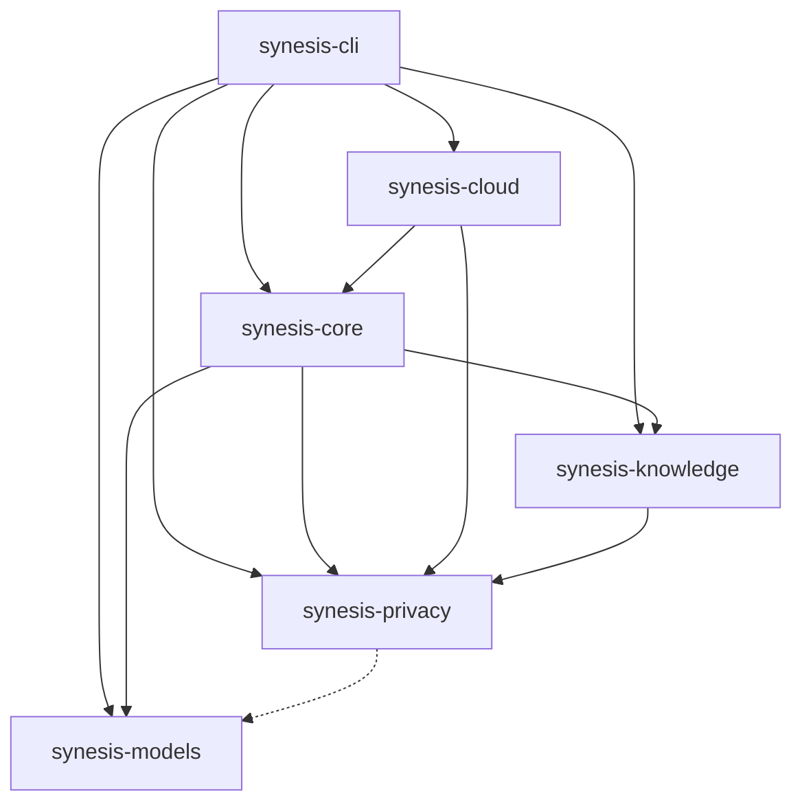

# SuperInstance Tool Ecosystem

> **Discover how SuperInstance components connect and work together**

**Version**: 1.0.0
**Last Updated**: 2026-01-08
**Status**: Active

---

## Overview

The SuperInstance ecosystem consists of modular, reusable tools that work together to create a privacy-first, local-first AI system. Each tool is designed to be useful on its own but shines when combined with others in the ecosystem.

### Ecosystem Principles

1. **Modularity**: Each tool is independently useful
2. **Composability**: Tools work better together
3. **Privacy-first**: All tools respect user privacy
4. **Local-first**: Tools work offline when possible
5. **Interoperability**: Standard interfaces between tools

---

## Tool Categories

### Core Libraries

| Tool | Description | Language | License | Status |
|------|-------------|----------|---------|--------|
| **synesis-core** | Tripartite consensus engine & agent orchestration | Rust | MIT/Apache-2.0 | Stable |
| **synesis-privacy** | Privacy proxy with 18+ redaction patterns | Rust | MIT/Apache-2.0 | Stable |
| **synesis-knowledge** | Vector database with RAG capabilities | Rust | MIT/Apache-2.0 | Stable |
| **synesis-models** | Hardware detection & model management | Rust | MIT/Apache-2.0 | Stable |
| **synesis-cloud** | QUIC tunnel & cloud connectivity | Rust | MIT/Apache-2.0 | Beta |
| **synesis-cli** | Command-line interface (uses all above) | Rust | MIT/Apache-2.0 | Stable |

### Cloud Components

| Tool | Description | Language | License | Status |
|------|-------------|----------|---------|--------|
| **cloud-synapse** | Durable Object for session state | TypeScript | MIT | In Development |
| **cloud-worker** | Edge compute & API gateway | TypeScript | MIT | In Development |

### Standalone Tools (Planned)

| Tool | Description | Use Case | Status |
|------|-------------|----------|--------|
| **privox** | Standalone privacy proxy CLI | Redact sensitive data in any workflow | Planned |
| **knowledge-vault** | Standalone vector database CLI | Local semantic search | Planned |
| **tripartite-rs** | Agent consensus library | Build multi-agent systems | Planned |

---

## Dependency Graph

### Internal Dependencies



### External Dependencies

| Tool | Key Dependencies | Why |
|------|------------------|-----|
| **synesis-core** | tokio, serde, async-trait | Async runtime, serialization |
| **synesis-privacy** | regex, rusqlite, uuid | Pattern matching, token vault |
| **synesis-knowledge** | rusqlite, notify, unicode-segmentation | Database, file watching |
| **synesis-cloud** | quinn, rustls, rcgen | QUIC protocol, TLS |
| **synesis-models** | sysinfo, dirs | System detection |

---

## Usage Graph

### What Uses These Tools?

#### Production Usage

- **[SuperInstance AI](https://github.com/SuperInstance/Tripartite1)** - Main project using all tools
  - Uses synesis-core for agent orchestration
  - Uses synesis-privacy for data redaction
  - Uses synesis-knowledge for RAG
  - Uses synesis-cloud for cloud connectivity

#### Community Projects

*Looking for projects using these tools? [Add yours to the list](https://github.com/SuperInstance/Tripartite1/issues/new?template=ecosystem_submission.md)!*

---

## Integration Patterns

### Pattern 1: Privacy + Knowledge

Combine privacy proxy with knowledge vault for secure RAG:

```rust
use synesis_privacy::PrivacyProxy;
use synesis_knowledge::KnowledgeVault;

// Redact before indexing
let redacted = privacy.redact(&document).await?;
vault.index(redacted, metadata).await?;

// Search and re-inflate
let results = vault.search(query).await?;
let restored = privacy.reinflate(&results).await?;
```

**Use cases**: Private codebases, confidential documents

### Pattern 2: Core + Cloud

Escalate to cloud when local resources insufficient:

```rust
use synesis_core::Council;
use synesis_cloud::EscalationClient;

// Try local first
let result = council.process(query).await?;

if result.confidence < threshold {
    // Escalate to cloud
    let cloud_result = escalation_client
        .escalate(query, context)
        .await?;
}
```

**Use cases**: Complex queries, limited local hardware

### Pattern 3: Models + Knowledge

Select optimal model based on knowledge retrieval:

```rust
use synesis_models::HardwareDetector;
use synesis_knowledge::KnowledgeVault;

// Check hardware
let hardware = detector.detect().await?;

// Choose model based on results + hardware
let model = if hardware.has_gpu && results.len() > 100 {
    "phi-3-mini-4k-instruct-gpu"
} else {
    "phi-3-mini-4k-instruct-cpu"
};
```

**Use cases**: Performance optimization, resource management

---

## Complementary Tools

### Works Well With

| Tool | Description | Integration |
|------|-------------|-------------|
| **[llama.cpp](https://github.com/ggerganov/llama.cpp)** | Local LLM inference | synesis-models manages models |
| **[SQLite-VSS](https://github.com/asg017/sqlite-vss)** | Vector search extension | synesis-knowledge uses this |
| **[Quinn](https://github.com/quinn-rs/quinn)** | QUIC implementation | synesis-cloud built on this |
| **[Tokio](https://tokio.rs/)** | Async runtime | All crates use tokio |
| **[Cloudflare Workers](https://workers.cloudflare.com/)** | Edge compute | Phase 2 cloud deployment |

### Suggested Combinations

| For | Use This Stack |
|-----|----------------|
| **Privacy-focused chatbot** | synesis-core + synesis-privacy + llama.cpp |
| **Code search** | synesis-knowledge + synesis-privacy + SQLite-VSS |
| **Local assistant** | synesis-core + synesis-models + synesis-knowledge |
| **Hybrid system** | synesis-cloud + synesis-core + synesis-privacy |

---

## Quick Navigation

### By Use Case

- **"I want to build an AI agent"** → Start with [synesis-core](https://github.com/SuperInstance/Tripartite1/tree/main/crates/synesis-core)
- **"I need to redact sensitive data"** → Use [synesis-privacy](https://github.com/SuperInstance/Tripartite1/tree/main/crates/synesis-privacy)
- **"I want semantic search"** → Try [synesis-knowledge](https://github.com/SuperInstance/Tripartite1/tree/main/crates/synesis-knowledge)
- **"I need cloud connectivity"** → Check [synesis-cloud](https://github.com/SuperInstance/Tripartite1/tree/main/crates/synesis-cloud)
- **"I want everything"** → Use [synesis-cli](https://github.com/SuperInstance/Tripartite1)

### By Language

- **Rust developers** → All core libraries
- **TypeScript developers** → Cloud components (Phase 2)
- **Python developers** → Planned SDK (Phase 4)
- **JavaScript developers** → Planned SDK (Phase 4)

---

## Ecosystem Stats

- **Total Tools**: 6 core libraries + 2 cloud components
- **Programming Languages**: Rust, TypeScript
- **Lines of Code**: ~50,000+
- **Test Coverage**: 250+ tests, 100% passing
- **Dependencies**: 30+ external crates
- **Active Contributors**: [See contributors](https://github.com/SuperInstance/Tripartite1/graphs/contributors)

---

## Contributing to the Ecosystem

### Add Your Project

Built something with SuperInstance tools? We'd love to feature it!

1. **Submit your project** using the [ecosystem submission template](https://github.com/SuperInstance/Tripartite1/issues/new?template=ecosystem_submission.md)
2. **Add ecosystem badge** to your README
3. **We'll review** and add you to the list

### Create a New Tool

Want to extend the ecosystem?

1. **Read the design principles** above
2. **Follow the integration patterns**
3. **Use standard interfaces** (traits in Rust)
4. **Add tests and documentation**
5. **Submit a PR** or open an issue to discuss

### Ecosystem Badge

Show your project is part of the ecosystem:

```markdown
[](https://github.com/SuperInstance/Tripartite1#ecosystem)
```

Preview: [](https://github.com/SuperInstance/Tripartite1#ecosystem)

---

## See Also

- **[Main Repository](https://github.com/SuperInstance/Tripartite1)** - SuperInstance AI project
- **[Architecture Documentation](../ARCHITECTURE.md)** - System design deep dive
- **[Phase 2 Roadmap](../phases/PHASE_2_DETAILED_ROADMAP.md)** - Cloud mesh implementation
- **[Contributing Guide](../CONTRIBUTING.md)** - How to contribute
- **[Examples](../examples/)** - Code examples

---

## Changelog

### 2026-01-08
- Initial ecosystem documentation
- Added dependency graphs
- Documented integration patterns
- Created ecosystem badge

---

**Maintained by**: [SuperInstance AI](https://github.com/SuperInstance)
**License**: MIT OR Apache-2.0
**Feedback**: [Open an issue](https://github.com/SuperInstance/Tripartite1/issues)
