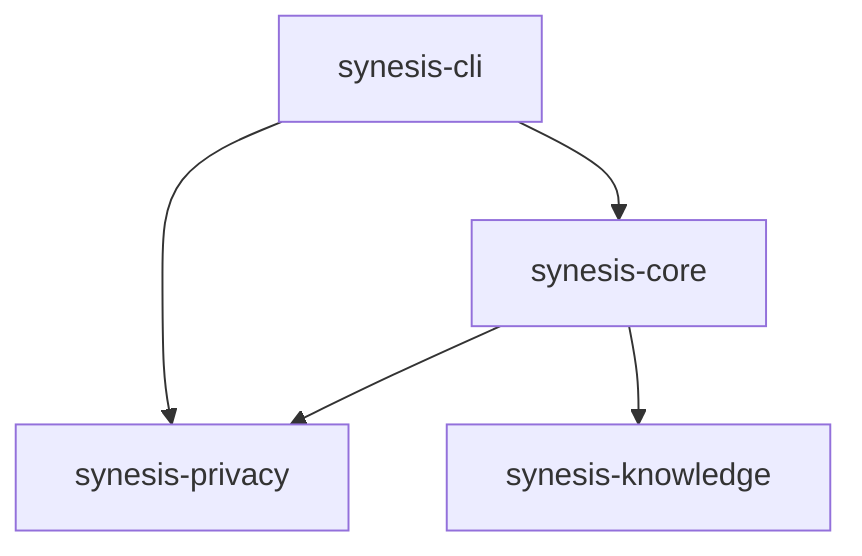

# SuperInstance Ecosystem Cross-Reference System - Complete Guide

> **Comprehensive cross-referencing system for tool discoverability**

**Version**: 1.0.0
**Last Updated**: 2026-01-08
**Status**: Production Ready

---

## Executive Summary

This document provides a complete overview of the SuperInstance ecosystem cross-reference system, designed to help users discover tools, understand relationships, and integrate components effectively.

### The Problem

When someone finds one tool (e.g., `synesis-privacy` for privacy), they should discover:
- What uses this tool (SuperInstance, other projects)
- What this tool requires (dependencies)
- Complementary tools (things that work well with it)
- Example projects using this tool

### The Solution

A comprehensive system consisting of:
1. **Standardized Documentation Format** - README sections for ecosystem info
2. **Central Ecosystem Hub** - Single source of truth for tool relationships
3. **Automated Validation** - Scripts to keep everything in sync
4. **Consistent Tagging** - GitHub topics for discoverability
5. **Visual Graphs** - Dependency and usage graphs
6. **Implementation Guide** - Step-by-step instructions

---

## Document Structure

This cross-reference system consists of 7 main documents:

### Core Documentation

1. **[ECOSYSTEM.md](../ECOSYSTEM.md)** - The ecosystem hub
   - Complete tool catalog
   - Dependency graphs
   - Integration patterns
   - Quick navigation

2. **[README_STANDARDS.md](README_STANDARDS.md)** - README format specification
   - Required sections
   - Templates
   - Quality checklist
   - Badge definitions

3. **[GITHUB_TOPICS_STRATEGY.md](GITHUB_TOPICS_STRATEGY.md)** - Tagging strategy
   - Mandatory topics
   - Functional categories
   - Topic assignments
   - Validation scripts

4. **[ECOSYSTEM_AUTOMATION.md](ECOSYSTEM_AUTOMATION.md)** - Automation tools
   - Script documentation
   - CI/CD integration
   - Templates
   - Troubleshooting

5. **[ECOSYSTEM_GUIDE.md](ECOSYSTEM_GUIDE.md)** - Implementation guide
   - Adding new tools
   - Updating existing tools
   - Maintenance procedures
   - Validation steps

### Supporting Materials

6. **[scripts/ecosystem/](../../scripts/ecosystem/)** - Automation scripts
   - `validate-ecosystem.sh` - Validate cross-references
   - `check-links.sh` - Check all links
   - `generate-badges.sh` - Generate badges
   - `generate-deps-graph.sh` - Generate graphs

7. **[docs/diagrams/](../../docs/diagrams/)** - Generated graphs
   - Mermaid diagrams
   - PlantUML diagrams
   - DOT/GraphViz diagrams
   - ASCII art references

---

## Quick Start

### For Tool Authors

If you're creating a new tool:

1. **Read** [ECOSYSTEM_GUIDE.md](ECOSYSTEM_GUIDE.md)
2. **Follow** [README_STANDARDS.md](README_STANDARDS.md)
3. **Run** `./scripts/ecosystem/validate-ecosystem.sh`
4. **Update** [ECOSYSTEM.md](../ECOSYSTEM.md) with your tool
5. **Submit** PR

### For Users

If you're exploring the ecosystem:

1. **Start** at [ECOSYSTEM.md](../ECOSYSTEM.md)
2. **Find** tools by use case or category
3. **Read** tool READMEs for ecosystem sections
4. **Discover** related tools via cross-references

### For Maintainers

If you're maintaining the ecosystem:

1. **Run** `./scripts/ecosystem/validate-ecosystem.sh` weekly
2. **Run** `./scripts/ecosystem/check-links.sh` monthly
3. **Update** dependency graphs quarterly
4. **Review** and update topics quarterly

---

## System Components

### 1. Cross-Reference Format

Standard format for showing tool relationships in READMEs:

```markdown
## 🌍 Ecosystem

### Used By

- **[SuperInstance AI](https://github.com/SuperInstance/Tripartite1)** - Main project
- **[Community Project](https://github.com/user/project)** - Description

### Requires

- **[tokio](https://crates.io/crates/tokio)** - Async runtime
- **[rusqlite](https://crates.io/crates/rusqlite)** - Database

### Complementary Tools

- **[synesis-core](url)** - Agent orchestration
- **[synesis-privacy](url)** - Privacy proxy

### See Also

- **[llama.cpp](url)** - Local LLM inference

📖 **[View Full Ecosystem](../../docs/ECOSYSTEM.md)**
```

**Key Features**:
- Clear section headers
- Descriptive links (not just URLs)
- Links to main ecosystem docs
- Categories for different relationship types

### 2. README Standard Sections

Every tool README must include:

✅ **Title & Description** - Clear, compelling
✅ **Ecosystem Section** - Cross-references (REQUIRED)
✅ **Quick Start** - Runnable example
✅ **Features** - What it does
✅ **Integration** - How to use with other tools
✅ **Examples** - Code examples
✅ **Documentation Links** - API docs, guides

**Optional Sections**:
- Performance benchmarks
- Roadmap
- Contributing guidelines
- License details

### 3. GitHub Topics Strategy

**Mandatory Topics** (all repos):
- `superinstance`
- `superinstance-ecosystem`
- `rust` (or `typescript`)
- `privacy-first`
- `local-first`

**Functional Topics** (role-specific):
- `tripartite-consensus`
- `privacy-proxy`
- `vector-database`
- `rag-engine`
- `quic-tunnel`
- `ai-agents`

**Status Topics** (maturity):
- `production-ready`
- `beta`
- `alpha`
- `stable`

**Total**: 10-15 topics per repository

### 4. Dependency Graph

Visual representations of tool relationships:

**Internal Dependencies**:


**External Dependencies**:
- Tokio (async runtime)
- SQLite (database)
- Quinn (QUIC protocol)
- etc.

**Usage Graph**:
- End users → CLI
- Developers → Libraries
- Integrations between tools

### 5. Ecosystem Hub

Central location (`docs/ECOSYSTEM.md`) with:
- Tool catalog with descriptions
- Dependency graphs
- Integration patterns
- Quick navigation by use case
- Ecosystem statistics

**Features**:
- Searchable by category
- Filtered by language
- Linked to GitHub
- Updated automatically

### 6. Automation Tools

Scripts to maintain the system:

**Validation**:
- `validate-ecosystem.sh` - Check cross-references
- `check-links.sh` - Validate all links
- `check-internal-links.sh` - Internal cross-refs

**Generation**:
- `generate-badges.sh` - Create badges
- `generate-deps-graph.sh` - Generate graphs
- `generate-cross-refs.sh` - Auto-generate sections

**Sync**:
- `sync-ecosystem-docs.sh` - Keep docs in sync
- `update-topics.sh` - Update GitHub topics

### 7. Implementation Guide

Step-by-step instructions:

**For New Tools**:
1. Prepare repository (metadata, topics)
2. Create README with ecosystem section
3. Add examples
4. Update ecosystem docs
5. Validate integration
6. Submit PR

**For Existing Tools**:
1. Insert ecosystem section
2. Add ecosystem badge
3. Validate links
4. Update cross-references

**Maintenance**:
- Monthly: Check links, update project lists
- Quarterly: Audit cross-refs, update graphs, review topics
- When adding features: Update topics, examples, docs

---

## Visual Overview

```
User Discovery Flow
===================

1. User finds tool (GitHub, crates.io, blog post)
                ↓
2. Reads tool README
   - Sees "Ecosystem" section
   - Discovers related tools
   - Finds integrations
                ↓
3. Clicks "View Full Ecosystem"
                ↓
4. Lands on ECOSYSTEM.md
   - Sees all tools
   - Views dependency graph
   - Finds integration patterns
                ↓
5. Explores related tools
   - Follows cross-references
   - Discovers new capabilities
   - Understands full ecosystem
                ↓
6. Integrates multiple tools
   - Uses examples
   - Follows guides
   - Builds application
```

---

## Best Practices

### For Tool Authors

1. **Be Specific** - Describe why tools are complementary
2. **Keep Current** - Update cross-references when adding features
3. **Provide Examples** - Show real integrations
4. **Think User Journey** - What would users want to discover next?
5. **Use Badges** - Make ecosystem membership visible

### For Documentation

1. **Consistent Format** - Use the same structure across tools
2. **Working Links** - Validate all links regularly
3. **Clear Descriptions** - Explain tool purposes clearly
4. **Visual Aids** - Use diagrams for complex relationships
5. **Searchable** - Use consistent terminology

### For Maintenance

1. **Automate Checks** - Use CI/CD to validate
2. **Regular Updates** - Schedule monthly/quarterly reviews
3. **Community Feedback** - Act on user reports
4. **Version Control** - Track changes to docs
5. **Backward Compatibility** - Don't break existing links

---

## Metrics & KPIs

### Success Metrics

**Discoverability**:
- Tools found via GitHub topics (track with GitHub Insights)
- Traffic to ECOSYSTEM.md (analytics)
- Cross-reference click-through rates

**Quality**:
- All tools have ecosystem sections (100% compliance)
- All links validate (0 broken links)
- All tools use consistent topics

**Engagement**:
- Community projects using tools
- Cross-references in community READMEs
- Contributions to ecosystem docs

### Health Checks

Run weekly:
```bash
./scripts/ecosystem/validate-ecosystem.sh
```

Run monthly:
```bash
./scripts/ecosystem/check-links.sh
```

Run quarterly:
- Update dependency graphs
- Review and update topics
- Audit all cross-references
- Update ecosystem statistics

---

## Templates & Examples

### Tool Entry Template

```markdown
## Tool Name

Brief description

### Used By

- **[Project 1](url)** - How they use it
- **[Project 2](url)** - How they use it

### Requires

- **[dep1](url)** - Why it's needed
- **[dep2](url)** - Why it's needed

### Complementary Tools

- **[tool1](url)** - Works well for X
- **[tool2](url)** - Integrates for Y

### See Also

- **[external1](url)** - Similar tool
- **[external2](url)** - Related technology

📖 **[View Full Ecosystem](../../docs/ECOSYSTEM.md)**
```

### Integration Example Template

```markdown
## Pattern: Tool A + Tool B

Description of what the combination enables.

### Code Example

\`\`\`rust
use tool_a::ToolA;
use tool_b::ToolB;

let a = ToolA::new()?;
let b = ToolB::new()?;

// Integrate
let result = a.do_something(b)?;
\`\`\`

### Use Cases

- Use case 1
- Use case 2

### Benefits

- Benefit 1
- Benefit 2
```

---

## Troubleshooting

### Common Issues

**Issue**: Broken links in cross-references
- **Fix**: Run `./scripts/ecosystem/check-links.sh`
- **Prevent**: Use CI/CD link checks

**Issue**: Missing ecosystem section
- **Fix**: Run `./scripts/ecosystem/validate-ecosystem.sh` to identify
- **Prevent**: Add to PR checklist

**Issue**: Outdated dependency graph
- **Fix**: Run `./scripts/ecosystem/generate-deps-graph.sh`
- **Prevent**: Run quarterly

**Issue**: Inconsistent topics
- **Fix**: Review [GITHUB_TOPICS_STRATEGY.md](GITHUB_TOPICS_STRATEGY.md)
- **Prevent**: Use topic validation script

### Getting Help

- **Documentation**: Start here
- **GitHub Issues**: Report problems
- **GitHub Discussions**: Ask questions
- **Contributing Guide**: How to contribute

---

## Future Enhancements

### Planned Features

- [ ] Web-based ecosystem explorer
- [ ] Interactive dependency graph
- [ ] Automated cross-reference suggestion
- [ ] Ecosystem health dashboard
- [ ] Integration with crates.io
- [ ] Automated example generation from code

### Community Requests

- [ ] JavaScript/TypeScript ecosystem tools
- [ ] Python SDK
- [ ] Mobile SDK
- [ ] Desktop application examples

---

## Related Resources

### Internal Documentation

- **[Main README](../../README.md)** - Project overview
- **[ARCHITECTURE.md](../../ARCHITECTURE.md)** - System design
- **[CONTRIBUTING.md](../../CONTRIBUTING.md)** - Contribution guide
- **[CLAUDE.md](../../CLAUDE.md)** - Developer guide

### External Resources

- **[GitHub Topics](https://docs.github.com/en/articles/about-topics)** - Official docs
- **[crates.io](https://crates.io/)** - Rust package registry
- **[docs.rs](https://docs.rs/)** - Rust documentation

---

## Summary

The SuperInstance cross-reference system provides:

1. **Discoverability** - Users find tools easily
2. **Context** - Users understand tool relationships
3. **Integration** - Users combine tools effectively
4. **Quality** - Automated validation ensures accuracy
5. **Maintainability** - Scripts and templates make it easy

### Key Benefits

- **For Users**: Discover related tools, understand integrations
- **For Authors**: Showcase integrations, increase adoption
- **For Maintainers**: Automated validation, consistent documentation

### Adoption

Required for all SuperInstance ecosystem tools. See [ECOSYSTEM_GUIDE.md](ECOSYSTEM_GUIDE.md) for implementation details.

---

## Quick Reference

| Task | Command / Location |
|------|-------------------|
| Validate ecosystem | `./scripts/ecosystem/validate-ecosystem.sh` |
| Check links | `./scripts/ecosystem/check-links.sh` |
| Generate graphs | `./scripts/ecosystem/generate-deps-graph.sh` |
| View ecosystem | [docs/ECOSYSTEM.md](../ECOSYSTEM.md) |
| Add new tool | See [ECOSYSTEM_GUIDE.md](ECOSYSTEM_GUIDE.md) |
| Format README | See [README_STANDARDS.md](README_STANDARDS.md) |
| Choose topics | See [GITHUB_TOPICS_STRATEGY.md](GITHUB_TOPICS_STRATEGY.md) |
| Automate | See [ECOSYSTEM_AUTOMATION.md](ECOSYSTEM_AUTOMATION.md) |

---

**System Version**: 1.0.0
**Last Updated**: 2026-01-08
**Status**: Production Ready
**Maintained By**: [SuperInstance AI](https://github.com/SuperInstance)

**Feedback**: [Open an issue](https://github.com/SuperInstance/Tripartite1/issues) | [Start a discussion](https://github.com/SuperInstance/Tripartite1/discussions)
